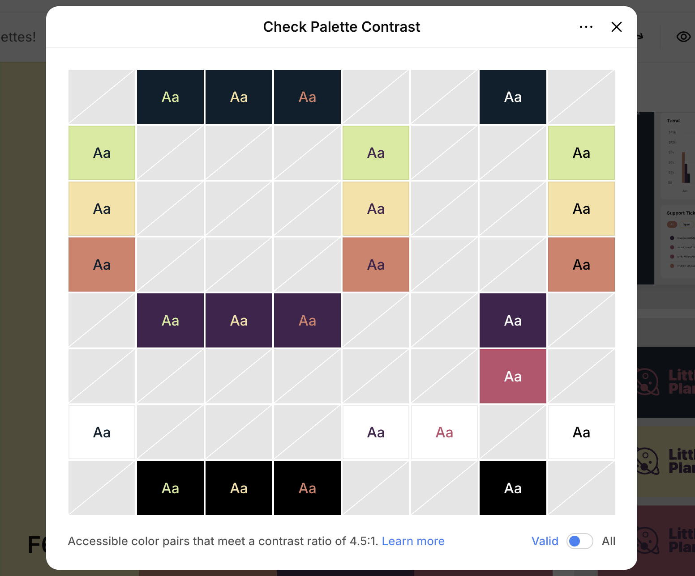

# Accordion text styles

A reference of every text element in the two accordion types and the styles applied to each, read from `static/tracker.css` (and the inline SVG/JS styles for dashboard plots).

## Token legend

| Token | Resolves to |
|------------------------------------|------------------------------------|
| `var(--mono)` | **Geist Mono** (`'Geist Mono', ui-monospace, 'SF Mono', monospace`) |
| `var(--sans)` | **Geist** (body default; used when no `font-family` is set) |
| `var(--text)` = `--ink-black` | **#0d1f2d** (ink-black) |
| `var(--text-muted)` | `oklch(0.553 0.013 58)` — medium warm gray |
| `var(--text-faint)` | `oklch(0.709 0.01 56)` — light gray |
| `var(--secondary-accent-strong)` | `oklch(0.52 0.112 35.8)` — **dark burnt-peach** (terracotta) |
| `var(--accent)` = `--rose-wine` | **#bd4f6c** |

------------------------------------------------------------------------

## A. Image-records accordion (`.section-card` → `.accordion-item`)

| Text element | Selector | Font | Size | Weight | Transform / spacing | Color |
|----------|----------|----------|----------|----------|----------|----------|
| **Section heading** (trigger title) | `.section-label` | Geist | 15px | 600 | uppercase, `0.04em` | **burnt-peach** (`--secondary-accent-strong`) |
| ↳ when section **incomplete** (vanilla-custard bg) | `.acc-incomplete > .accordion-trigger` | — | — | — | — | overridden to `--ink-black` #0d1f2d |
| **External link in heading** (e.g. aiornot.com) | inline on `<a>` | inherits Geist Mono | inherits 15px | **400** | inherits uppercase | rose-wine (`--accent`) |
| **Chevron** (icon, not text) | `.accordion-chevron` | 16×16 SVG | — | — | rotates 180° when open | `--text-faint` |
| **Field labels** (content) | `.field label` | Geist Mono | 12px | 500 | none | `--text-muted` (→ `--ink-black` when incomplete) |
| **"(auto)" tags** | `.auto-tag` | inherits Geist Mono | 11px | 400 | none | `--text-faint` |
| **Hint text** | `.hint-box` | Geist (sans) | 12px | normal | `line-height 1.6` | `--text-faint` |
| **Instruction box** | `.instruction-box` | Geist (sans) | 12px | normal | — | `--text-muted` (`<strong>` → `--accent`) |
| **Field values** (inputs) | inherited | Geist | 13px | normal | — | `--text` (#0d1f2d) |

Trigger layout (not text): `padding 0.9rem 1.5rem`, flex `space-between`, `:hover { opacity 0.7 }`, bottom border when open.

------------------------------------------------------------------------

## B. Dashboard accordion (`.dash-group`)

| Text element | Selector | Font | Size | Weight | Transform / spacing | Color |
|----------|----------|----------|----------|----------|----------|----------|
| **Group title** (summary) | `.dash-group > summary` | Geist Mono | 18px | 600 | uppercase, `0.04em` | **burnt-peach** (`--secondary-accent-strong`) |
| ↳ toggle marker ▸/▾ | `summary::before` | — | 9px | — | — | `--text-faint` |
| **Section title** | `.dash-section-title` | Geist | 15px | 600 | uppercase, `0.04em` | **burnt-peach** (`--secondary-accent-strong`) — identical to `.section-label` |
| **Section subtitle** | `.dash-section-subtitle` | Geist (sans) | 12px | normal | none | `--text-muted` |
| **Summary card number** | `.dash-card-num` | Geist Mono | 2rem | 600 | `line-height 1` | rose-wine (`--accent`) |
| **Summary card label** | `.dash-card-label` | Geist (sans) | 11px | normal | none | `--text-muted` |
| **Bar label** | `.dash-bar-label` | Geist Mono | 11px | normal | right-aligned | `--text` (#0d1f2d) |
| **Bar count** | `.dash-bar-count` | Geist Mono | 11px | normal | right-aligned | `--text-muted` |
| **Bar count (wide)** | `.dash-bar-count-wide` | Geist Mono | 11px | normal | right-aligned | `--text-muted` |
| **Indicator label** | `.dash-indicator-label` | Geist Mono | 10px | 500 | uppercase, `0.06em` | `--text-muted` |
| **Table header** | `.dash-table th` | Geist Mono | 11px | 500 | uppercase, `0.06em` | `--text-muted` |
| **Table cell** | `.dash-table td` | Geist (sans) | 12px | normal | none | `--text` (#0d1f2d) |
| **Confusion-matrix cell** | inline | Geist Mono | 18px | normal | centered | `--text` (#0d1f2d) |

### Plot text (SVG; styles set inline in `tracker.js`)

| Text element                         | Font       | Size    | Color (`fill`)     |
|------------------|------------------|------------------|------------------|
| Axis tick labels                     | Geist Mono | 9px     | `--text-muted`     |
| X-axis unit label                    | Geist Mono | 9px     | `--text-faint`     |
| Legend items                         | Geist Mono | 11px    | `--text-muted`     |
| Scatter model labels / RF checkboxes | Geist Mono | 0.82rem | `--text` (#0d1f2d) |

------------------------------------------------------------------------

Both accordion types share the same section-heading treatment (Geist, uppercase, burnt-peach, 15px). Dashboard group titles (`.dash-group > summary`) remain Geist Mono at 18px. Smaller body labels in the dashboard use gray (`--text-muted` / `--text-faint`).

---

## Palette contrast

Palette color pairs that meet the WCAG 4.5:1 contrast ratio (from the Coolors contrast checker):

